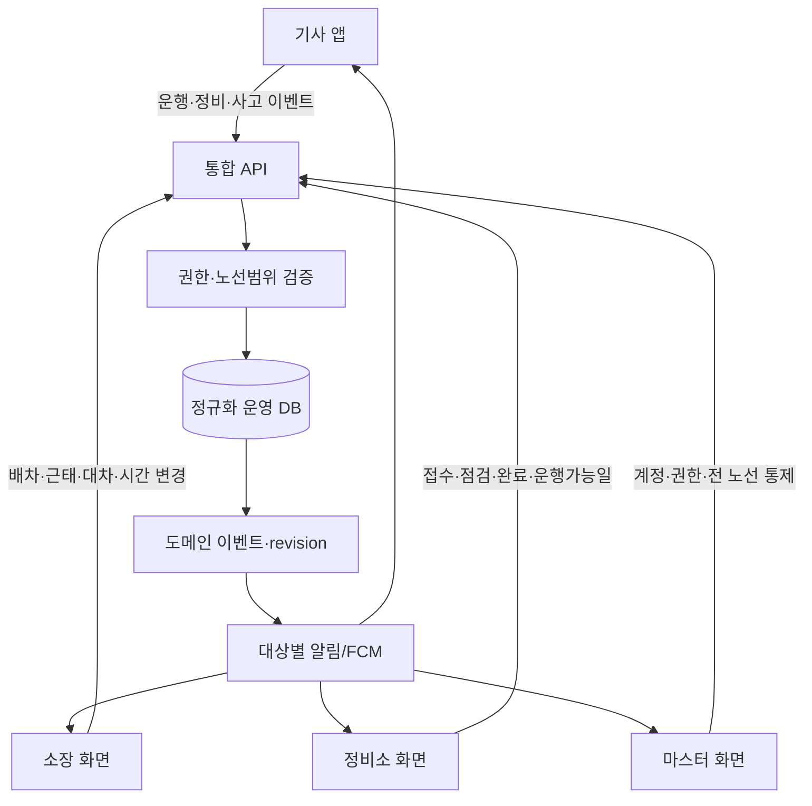
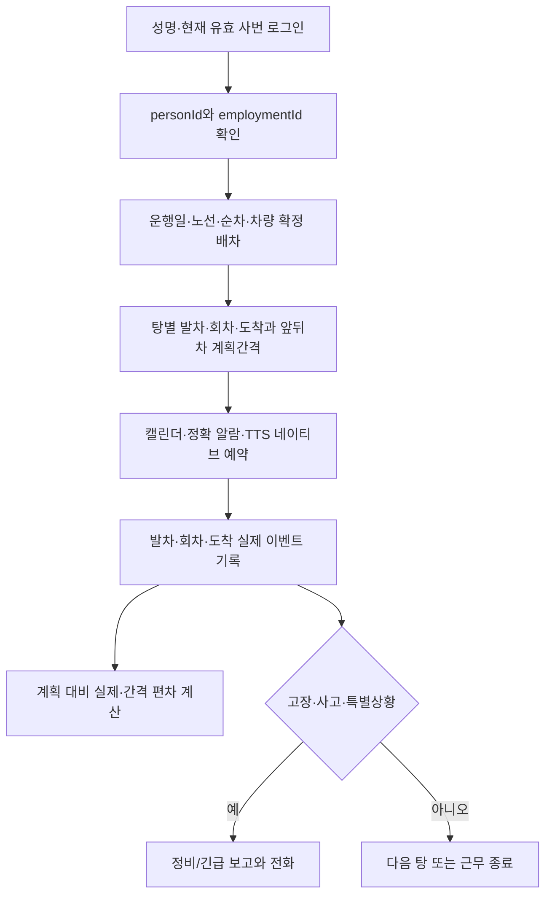
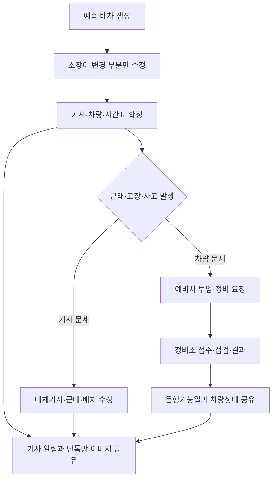

# 소신여객 통합 운행 플랫폼 정규화 기준

기준일: 2026-10-07
적용 범위: 70번 양성기사 운영, 5번 정규직·예비기사 운영, 향후 전 노선 확장

## 1. 정규화 원칙

1. 사람, 고용, 사원번호, 노선 배치는 서로 다른 이력이다.
   - `personId`: 사람의 영구 식별자. 퇴직·재입사 후에도 유지한다.
   - `employmentId`: 입사부터 퇴직까지의 고용 단위. 재입사 시 새로 만든다.
   - `empNo`: 유효기간을 가진 사원번호. 양성기사 6xxxxx에서 정규직 4xxxxx로 바뀌어도 과거 기록을 보존한다.
   - `driverAssignmentId`: 노선·근무조·기사구분의 유효기간 이력이다.
2. 노선은 모든 운영 데이터의 필수 키다. 70번과 5번 데이터를 물리적으로 복제하지 않고 `routeId`로 구분한다.
3. 확정 배차와 실제 운행은 분리한다. 예정값을 수정하지 않고 실제값과 변경 이벤트를 별도로 기록한다.
4. 운행일은 한국시간 03:30부터 다음날 02:29까지다. 시간 저장은 `serviceDate + serviceMinute`를 기준으로 하고 화면에서 24시간제와 12시간제를 함께 표시한다.
5. 상태를 덮어쓰는 대신 이벤트와 이력을 남긴다. 근태, 배차 변경, 정비, 사고, 알림 전달은 모두 누가·언제·무엇을 바꿨는지 기록한다.

## 공개 코드와 운영자료의 경계

- 공개 Git 저장소에는 권한·검증·계산 로직과 전부 가상인 테스트 fixture만 둔다.
- 실명, 사번, 실제 차량번호, 날짜별 배차, 정확한 운행시간표, 검증 GPS 좌표는 배포 폴더의 Git 제외 파일 또는 보호된 서버 저장소에서만 공급한다.
- 공개 노선 모듈은 비공개 저장소 인터페이스를 통해서만 기준자료를 읽는다. 자료나 교대 기준 설정이 없으면 추정값을 만들지 않고 명시적인 설정 오류를 반환한다.
- 기존 배포본에 코드와 자료가 섞여 있으면 새 공개 모듈을 덮어쓰기 전에 원본을 외부 백업하고 운영자료를 로컬 전용 파일로 자동 이전한다.
6. 앱은 마지막 정상 데이터를 로컬에 보관하되, `서버 확인 시각`과 `revision`을 함께 표시한다. 캐시 데이터를 새 확정 데이터처럼 취급하지 않는다.

## 2. 권장 데이터 영역

| 영역 | 정규화 테이블(시트) | 핵심 키와 역할 |
|---|---|---|
| 신원·고용 | `인물DB`, `고용이력DB`, `사번이력DB` | `personId`, `employmentId`, 사번 유효 시작·종료일 |
| 권한 | `계정DB`, `역할범위DB` | DRIVER·MANAGER·CENTER·MASTER와 담당 `routeId` 범위 |
| 노선 | `노선DB`, `정류장DB`, `노선정류장DB` | 70·5번 및 향후 노선, 정류장 순서·방향 |
| 기사 배치 | `기사배치이력DB`, `근태이벤트DB` | 노선·A/B/예비·양성/정규 이력, 휴무·병가·지각·퇴직·복귀 |
| 차량 | `차량DB`, `차량노선이력DB` | 차량 고유 ID, 표시번호, 에너지원, 상태, 노선 유효기간 |
| 시간표 | `시간표버전DB`, `탕시간표DB` | 노선·운행유형·버전·순차·탕·발차/회차/도착 시간 |
| 배차 | `운행일DB`, `배차DB`, `배차변경DB`, `배차확인DB` | `routeId + serviceDate + sequence`, 기사·차량·확정 버전 |
| 실제 운행 | `운행이벤트DB`, `운행일지DB` | 발차·회차·도착 실제시각, GPS/수동 기록방식, 계획 대비 편차와 앞뒤차 간격 |
| 돌발·정비 | `사건DB`, `정비DB`, `정비이력DB` | 사고·고장·정기점검, 요청자, 처리자, 예비차, 운행가능일 |
| 알림·공유 | `알림설정DB`, `알림전달DB`, `도메인이벤트DB` | 기기별 설정, 전송·수신·확인, 변경 revision |
| 실시간 위치 | `노선위치기준DB`, `운행상태DB` | 검증 기준점·반경, 현재 정류장·방향·속도·GPS 시각. 운행 중 동의와 권한 필요 |

기존 `기사DB.driverId`는 1차 마이그레이션 동안 `personId` 호환키로 유지한다. 사번과 현재노선을 직접 덮어쓰는 현재 방식은 이력 테이블로 옮긴 뒤 읽기 전용 현재값으로 전환한다.

## 3. 전체 처리 흐름

## 4. 기사 운행 흐름

기사 화면의 기본 표시 단위는 `오늘 내 배차`다. 각 탕에는 발차지·발차시간, 회차지·회차시간, 도착지·도착시간, 앞차·뒷차 순차와 계획/실제 간격을 함께 표시한다. 00:00~02:29 시각에는 `다음날` 표기를 붙인다.

### 기사 모바일 화면과 위치 기록

- `전체 펼침`은 해당 운행일의 모든 탕을 한 화면에 표시하고, `탕별 카드`는 한 탕씩 이전·다음으로 넘긴다.
- 상단 요약에는 운행일, 노선, A/B조, 순차, 차량, 총 탕 수와 완료 탕 수를 표시한다.
- `운행일지`의 `도착실제`가 저장된 탕은 완료로 판정하여 회색으로 표시한다. 발차·회차·도착 실제시각과 기록방식도 예정시각 옆에 표시한다.
- 위치 자동 기록은 기사가 명시적으로 시작한 현재 운행일에만 동작한다. 발차 기준점 내부가 두 번 확인된 뒤 이탈하면 발차, 회차·도착 기준점 진입이 두 번 확인되면 각각 회차·도착 이벤트를 서버 시간으로 저장한다.
- Android 설치형 앱은 `location` 전경 서비스를 사용하므로 화면이 꺼진 동안에도 지속 알림을 표시하며 판정을 계속한다. 브라우저 단독 실행은 화면이 활성 상태일 때만 보장한다.
- 연속 GPS 좌표는 서버로 전송하지 않는다. 확정된 이벤트의 시각, 위도·경도, GPS 정확도와 `GPS 자동/수동` 구분만 운행일지에 저장한다.
- 기준점은 임의 추정하지 않는다. `노선위치기준DB`에 노선·선택 순차·선택 탕·구분(발차/회차/도착/공통)·지점명·검증 좌표·반경을 등록한 항목만 사용한다.

`노선위치기준DB` 기본 열은 다음과 같다.

| 열 | 내용 |
|---|---|
| `기준점ID` | 변경되지 않는 고유 ID |
| `노선` | 70, 5 등 노선 ID |
| `순차`, `탕` | 비우면 노선 공통, 입력하면 해당 운행에 우선 적용 |
| `구분` | 발차·회차·도착·공통 |
| `지점명` | 시간표 지점명과 일치하는 명칭 |
| `위도`, `경도` | 현장 검증 좌표 |
| `반경m` | 20~500m, 미입력 시 80m |
| `사용여부` | Y/N |

## 5. 소장·정비소 처리 흐름

- 소장: 담당 노선의 기사·차량·배차·근태·대차·시간 변경을 확정한다. 계정 생성·권한 부여는 하지 않는다.
- 정비소: 요청은 생성할 수 있지만, 정비의 접수·진행·완료·운행 가능 판정은 CENTER 또는 MASTER만 확정한다.
- 마스터: 계정, 역할 범위, 전 노선, 기사 전환·재입사와 모든 예외를 통제한다.
- 기사: 본인 배차·본인 차량 관련 정보만 보고 요청한다. 사고는 정비 요청과 별도의 긴급 사건으로 기록하고 즉시 전화 버튼을 제공한다.

### 5번 노선 시간표 예외와 수기 변경

- 1·3·5순차의 1탕은 삼정동복지회관에서 시작한다. 2·4순차는 1탕이 존재하지 않으며 고강공영차고지에서 2탕부터 시작한다.
- 4순차 7탕은 테크노파크 정류소에서 영업을 종료하고 차고지로 회귀하는 상행 막차다. 23순차 막탕은 상·하행 운행을 모두 마치는 왕복 막차다.
- 2·26·27순차의 테크노파크 종료 표시는 막차 두 건과 혼합하지 않고 `SHORT_TURN_END`로 구분한다.
- 배포된 인쇄 시간표 값은 수정하지 않는다. 현장 수기 조정은 `노선·날짜·순차·탕·시간구분·원본시간·변경시간·확정상태·공지채널·원본근거` 이력으로 추가한다.
- 단톡방 사진에서 수기 표시가 보여도 값이 불명확하면 자동 적용하지 않는다. 소장 또는 마스터가 원문을 대조해 `확정`한 변경만 기사 화면·알람·TTS의 유효 시간으로 사용하고 원본 시간도 함께 보존한다.

## 6. 실시간 반영 규칙

1. 쓰기 요청이 성공하면 서버는 대상 노선·운행일의 `revision`을 증가시키고 `도메인이벤트DB`에 기록한다.
2. 화면이 열린 경우 짧은 delta 조회 또는 push 수신으로 변경분만 반영한다.
3. Android 화면이 닫힌 경우 FCM data message가 앱에 변경을 알리고, 앱은 배차 버전을 재확인한 뒤 기존 네이티브 알람을 취소·재등록한다.
4. Apps Script 단독 polling은 화면 종료 상태의 즉시 반영을 보장하지 못한다. 정확 알람은 현재 Android 네이티브 모듈이 담당하고, 확정 배차 변경의 즉시 전달은 FCM 단계가 필요하다.
5. 모든 화면에는 `서버 확인 시각`, `데이터 revision`, `최근 저장정보/서버 확인 완료` 상태를 구분해서 표시한다.

## 7. 현재 구현과 차이

| 항목 | 현재 상태 | 다음 조치 |
|---|---|---|
| 양성→정규 사번·노선 전환 | 내부 `driverId` 유지 및 변경이력 일부 구현 | 사번/고용/노선 이력을 독립 테이블로 분리 |
| 70번·5번 데이터 | 노선별 사진 판독 기준 모듈과 확정 배차 우선 조회 구현 | 모든 저장에 `routeId` 필수화, 사진 기준자료를 정규 시간표·배차 이력으로 승인 이관 |
| 기사 알람·TTS | Android 정확 알람·캘린더 연동 구현 | 배차 revision 변경 시 자동 재동기화 |
| 운행일지 | 수동/GPS 발차·회차·도착과 계획값 저장 구현 | 실차 검증 후 기준점 반경 보정, 실제 앞뒤차 간격 자동 계산 추가 |
| 정비 공유 | 요청·접수·진행·완료와 예비차 일부 구현 | 노선범위·읽음확인·긴급사고 채널 분리 |
| 실시간 표시 | 화면 활성 시 주기 조회 | delta API + FCM + 로컬 revision 적용 |
| 기사 화면 | 전체 펼침/탕별 카드, 완료 회색 처리, GPS 정확도·속도 표시 | 정류장 진행도·방향과 실제 앞뒤차 간격 요약 추가 |
| 연결 안정성 | 중복 ping/로그인 및 오래된 캐시 혼선 가능 | 단일 보안 로그인, 45초 제한, 캐시/서버 상태 분리 적용 |

## 8. 적용 순서

1. 연결·로그인 안정화와 서버/캐시 상태 구분
2. `routeId`, `personId`, `employmentId`, `revision` 컬럼을 무중단 추가
3. 70번 기존 데이터를 새 이력 구조로 이관하고 결과 대조
4. 5번 기준자료와 실제 기사·차량 마스터를 동일 구조로 등록
5. 소장 노선 선택, 노선별 예측·확정·이미지 공유 통합
6. 기사 실시간 운행 화면, 사고 긴급전화, GPS 운행 이벤트 추가
7. FCM 변경 이벤트와 화면 종료 상태 배차 재동기화 검증

각 단계는 기존 배차·퇴직·재입사·운행·정비 기록을 삭제하거나 덮어쓰지 않고 추가 컬럼과 이력행으로 전환한다.
